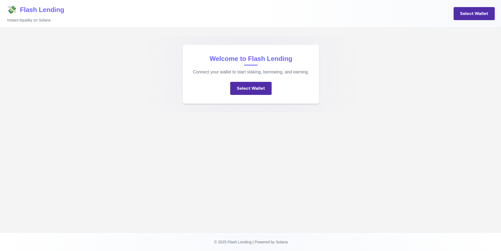

# FlashLend

## Introduction
FlashLend is a decentralized lending protocol built on Solana using the Anchor framework. It enables users to stake tokens into a lending pool, request short-term flash loans, and earn fees based on loan repayments. The protocol ensures efficient lending and borrowing with a reputation-based fee system.

## Features
### Staking:
- Users can stake tokens into the lending pool.
- Earn passive income from loan interest and accumulated fees.
- Stake can be withdrawn at any time, subject to pool availability.

### Borrowing:
- Users can request flash loans with a defined duration.
- Loan fees are determined based on user reputation.
- Loans must be repaid before the expiration time.

### Reputation System:
- Borrowers build reputation by successfully repaying loans.
- Higher reputation leads to lower borrowing fees.

### Loan Repayment:
- Borrowers must repay loans within the specified duration.
- Repayment includes the loan amount plus an interest fee.

### Security & Risk Management:
- Expired loans are automatically cleaned from the system.
- The contract ensures proper fee accumulation and distribution.
- Admins can reset the pool when necessary.

---

## Contract Details
### Staking and Pool Management
- **Stake Tokens:** Users stake tokens in the pool to increase liquidity.
- **Withdraw Stake:** Users can withdraw staked tokens based on availability.
- **Pool Parameters:**
  - Total Staked: Total amount of tokens in the pool.
  - Available: Tokens available for loan issuance.
  - Accumulated Fees: Fees collected from loan interest.

### Loan Issuance & Repayment
- **Request Loan:** Users can borrow tokens with a predefined duration.
- **Loan Terms:**
  - Loan amount: Minimum 10M tokens, maximum 1T tokens.
  - Loan duration: 10 seconds to 1 hour.
  - Fees: 1% standard, 0.5% for high-reputation users.
- **Repay Loan:** Borrowers repay the loan amount plus a fee.
- **Reputation System:** Borrowers who repay successfully gain reputation, reducing future loan fees.

### Pool Maintenance
- **Reset Pool:** Admin can reset the pool to reinitialize the state.
- **Clean Expired Loans:** Removes loans that are overdue.

---

## Functions Overview
### User Functions
- `stake_to_pool(amount: u64)`: Stake tokens into the pool.
- `withdraw_stake(amount: u64)`: Withdraw tokens from the pool.
- `request_loan(amount: u64, duration: u64)`: Request a loan.
- `repay_loan()`: Repay the loan before expiration.

### Admin Functions
- `reset_pool()`: Reset the lending pool state.
- `clean_expired_loans()`: Remove expired loans from the contract.

### Utility Functions
- `get_pool_details()`: View details of the lending pool.
- `calculate_fee(amount: u64, reputation: u64)`: Calculate loan fees.

---

## Usage Instructions
### Deployment
1. Deploy the FlashLend smart contract using Anchor on Solana.
2. Initialize the lending pool using `initialize_pool()`.

### Staking
1. Call `stake_to_pool(amount)` to stake tokens.
2. View staked amount with `get_pool_details()`.
3. Withdraw stake using `withdraw_stake(amount)`.

### Borrowing
1. Request a loan using `request_loan(amount, duration)`.
2. Repay the loan before the expiration using `repay_loan()`.

### Admin Actions
- Call `reset_pool()` to clear all data and restart the pool.
- Use `clean_expired_loans()` to remove overdue loans.

---

## Events
- `Staked(address user, uint256 amount)` - User staked tokens.
- `LoanRequested(address borrower, uint256 amount, uint256 duration)` - Loan requested.
- `LoanRepaid(address borrower, uint256 amount, uint256 fee)` - Loan successfully repaid.
- `StakeWithdrawn(address user, uint256 amount)` - Stake withdrawn.
- `PoolReset(address admin)` - Pool reset by admin.
- `ExpiredLoansCleaned(uint256 count)` - Expired loans removed.

---

## Security Considerations
- Ensure contract audits before deploying to mainnet.
- Only stake tokens you are willing to risk.
- Monitor loan expiration to avoid penalties.

---

## License
This project is licensed under the MIT License. See the LICENSE file for more details.

---

## Support
For issues and support, open an issue on the [GitHub repository](https://github.com/YOUR_GITHUB_REPO) or contact us via email.

---

## Links
- **GitHub Repository:** [FlashLend](https://github.com/Anish99594/FlashLend.git)
- **Demo Video:** [Watch Here](https://youtu.be/fnnH8zQoM2s)
- **Project Website:** [Visit Here](https://flash-lend.vercel.app/)

